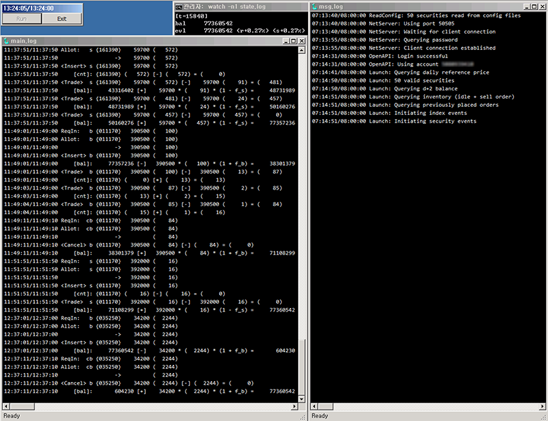

# KiwoomAgent

KiwoomAgent is an application for live-trading intraday Stock/ETF/ELW in
South Korean KOSPI market using *Kiwoom Securities* OpenAPI.

It is intended to be used in tandem with
[Sibyl](https://github.com/junosan/Sibyl) repository
(although not necessarily, as long as the communication protocol is
implemented).
In its server/client model, an agent, such as this one, can substitute
its backtesting simulator (`simserv`), allowing exactly the same code to be
used for both backtesting and live-trading.

The communication between server/client is designed to be synchronous.
This means that the events coming from the market are integrated in time and
communicated as states rather than as raw events.
Furthermore, orders are addressed only by their prices and quantities
rather than by, e.g., order IDs, allowing a market/broker agnostic operation.
The balance, inventory, order status, and some statistics define the state
to be sent for communication.

More specifically, an agent
- maintains a mini order book of client's orders, and also keeps track of
  market/broker specific information such as order IDs
- receives order events from the broker and applies them to the mini order book
- relays market/broker agnostic order requests from the client to the broker,
  transparently handling market/broker specific details
- keeps track of balance, inventory, and statistics by integrating events
  from the broker
- receives real-time intraday market data
- updates client with the current state periodically

[Sibyl](https://github.com/junosan/Sibyl)'s `simserv` implements exactly the
same features, but events are generated from pre-stored data rather than
the market.

## Requirements
- A trading account at *Kiwoom Securities*
- *Kiwoom Securities* OpenAPI (after installing, OpenAPI feature also needs to
  be activated on on their website; to trade ELWs and certain ETFs, additional
  agreement needs to be signed with them)
- Visual C++ Redistributable for Visual Studio 2015 Update 2
  (or versions compatible with it)

## How to use
- Before opening the Visual Studio project, 
  clone [Sibyl](https://github.com/junosan/Sibyl) and copy (or symlink)
  the contents of `src/core/sibyl` into this repository's `KiwoomAgent/sibyl`
- After building, see instructions for live-trading in 
  [Sibyl](https://github.com/junosan/Sibyl)
- Log files `main.log` (details of order requests, re-allocation, execution,
  and transaction events) and
  `msg.log` (miscellaneous messages and OpenAPI error messages) can be
  monitored in real-time using [SnakeTail](http://snakenest.com/snaketail/)
  in a way similar to `tail -f` in *nix environments, as shown in the
  screenshot above

## Notes
- Due to the human-intervention-inviting update procedure of
  *Kiwoom Securities* OpenAPI, the login cannot be reliably automated.
  Hence, it is recommended that this program be started/stopped manually.
- Due to restrictions of *Kiwoom Securities* OpenAPI, any Korean text appearing
  in their API must be in EUC-KR encoding, and their API malfuctions severely
  under a Unicode compile environment.
  Hence, the project itself is also built in that encoding, and some source
  code files contain text in that encoding (yes, they have built their API
  in a way that cannot be used without EUC-KR Korean text in source codes).
  These source code files will need special care if being opened, and
  especially if being re-saved, in *nix enviroments.

